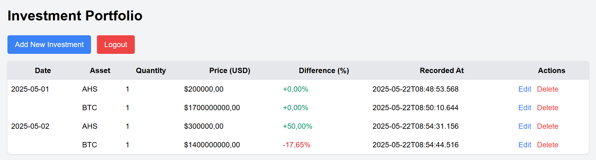

# PM360 Investment Portfolio Manager



## Description

PM360 is a simple web application for tracking and managing your investment portfolio. Powered by Spring Boot, Thymeleaf, and Tailwind CSS, PM360 lets you record the date, asset, quantity, price, and automatically computed percentage difference for each transaction.

## Features

* Add, edit, and delete investment records
* Automatic calculation of the price difference (%) based on the last entry for the same asset
* User authentication with admin credentials
* SQLite-backed persistence via JPA
* Responsive UI built with Tailwind CSS and Thymeleaf templates

## Prerequisites

* Java 17+
* Maven 3.6+
* Git

## Installation

1. **Clone the repository**

   ```bash
   git clone https://github.com/yourusername/pm360.git
   cd pm360
   ```

2. **Configure environment**
   Copy the example `.env` file into `src/main/resources/.env` and adjust as needed:

   ```ini
   DB_URL=jdbc:sqlite:./pm360.db
   DB_USERNAME=
   DB_PASSWORD=
   ADMIN_USERNAME=admin
   ADMIN_PASSWORD=admin123
   ```

3. **Build and run**

   ```bash
   mvn clean package
   mvn spring-boot:run
   ```

4. **Access the application**
   Open your browser and navigate to `http://localhost:8080/investments`. Log in with the admin credentials from your `.env`.

## Configuration

* **Database**: Uses SQLite by default. Modify `DB_URL` in `.env` to point to another JDBC-compatible database.
* **Authentication**: Admin username and password configured via `ADMIN_USERNAME` and `ADMIN_PASSWORD` in `.env`.

## Application Flow

1. **Login**: Users authenticate using the admin credentials.
2. **View Portfolio**: The `/investments` page lists all recorded investments, showing date, asset, quantity, price (USD), difference (%), and timestamp.
3. **Add Investment**: Navigate to `/investments/new` to add a transaction. The difference field is auto-calculated: if you add a record for an existing asset (e.g., BTC), PM360 compares the new price with the last price entry and computes the percentage change.
4. **Edit/Delete**: Modify or remove existing entries via the actions column.

## Usage

* **Adding a new asset**: When you first record an asset, the difference (%) will be 0%.
* **Subsequent entries**: Each time you add the same asset, PM360 calculates the change relative to its most recent recorded price.

## License

MIT 